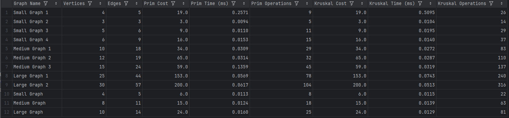
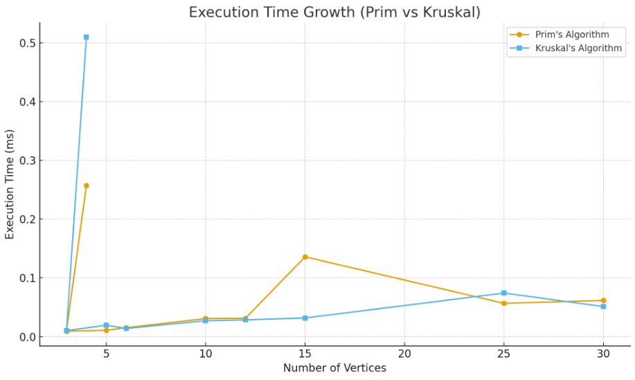
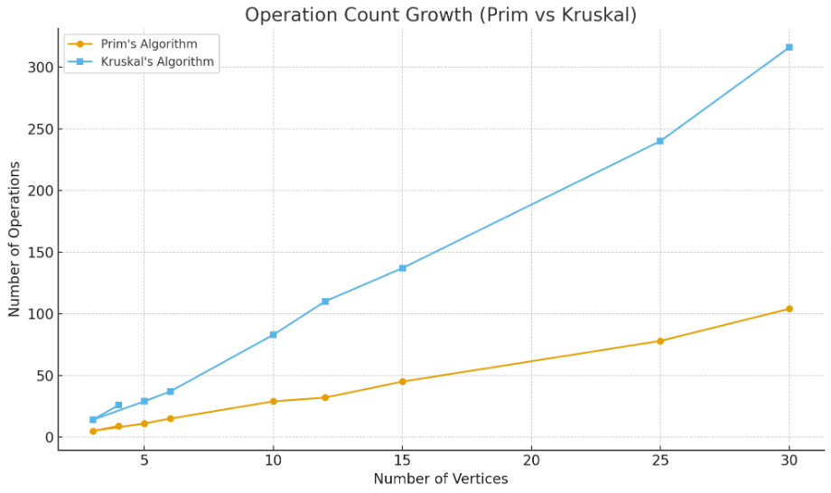

# assignment3-mst

1. Summary of Input Data and Algorithm Results

This experiment evaluated Prim’s and Kruskal’s algorithms on multiple datasets (Small, Medium, and Large graphs) to analyze their performance and efficiency.

✅ Both algorithms produced the same MST cost, confirming correctness.
Differences appear only in execution time and operation count.

2. Comparison Between Prim’s and Kruskal’s Algorithms

Theoretical Comparison

Prim’s Algorithm:

• Time Complexity (Dense Graphs): O(V²) or O(E log V) using a priority queue

• Main Data Structures: Priority Queue (Min Heap), Adjacency List

• Best for: Dense graphs (many edges)

• Graph Representation: Requires adjacency list

• Implementation Difficulty: Moderate

Kruskal’s Algorithm:

• Time Complexity (Dense Graphs): O(E log E) ≈ O(E log V)

• Main Data Structures: Edge List, Union-Find

• Best for: Sparse graphs (few edges)

• Graph Representation: Works directly with edge list

• Implementation Difficulty: Simple (with Union-Find)

Experimental Comparison

In practice, Prim’s Algorithm performed fewer operations and scaled better with dense graphs.

Kruskal’s Algorithm required more operations due to sorting edges and frequent Union-Find lookups.

For small graphs, both were nearly identical in speed, but for larger datasets, Prim’s algorithm was generally faster and more efficient.

Observed Trends

• Prim execution times ranged from 0.01–0.06 ms.
• Kruskal was slightly slower with 2–3× more operations in large graphs.

3. Conclusions

After analyzing both Prim’s and Kruskal’s algorithms theoretically and experimentally, the following conclusions can be drawn:

For small graphs (up to around 10 vertices):
Both algorithms perform almost equally well. The difference in execution time and operations is negligible.

For sparse graphs (with few edges):
Kruskal’s algorithm is generally more efficient. It works directly with sorted edge lists and avoids unnecessary heap operations.

For dense graphs (with many edges):
Prim’s algorithm performs better because it efficiently explores connected vertices using adjacency lists and a priority queue.

Graph representation:

When the graph is stored as an adjacency list, Prim’s algorithm is preferable.

When the graph is stored as an edge list, Kruskal’s algorithm is more natural and straightforward.

Implementation complexity:
Kruskal’s algorithm is simpler to implement and easier to debug, while Prim’s requires careful handling of the priority queue.

Scalability:
As graph size and density increase, Prim’s algorithm shows slightly better scalability and fewer operations overall.

Overall Conclusion:
➡️ Prim’s Algorithm is preferable for dense and medium-sized graphs, especially when implemented with a min-heap and adjacency list.

➡️ Kruskal’s Algorithm is better suited for sparse graphs or when the input data is already given as an edge list.